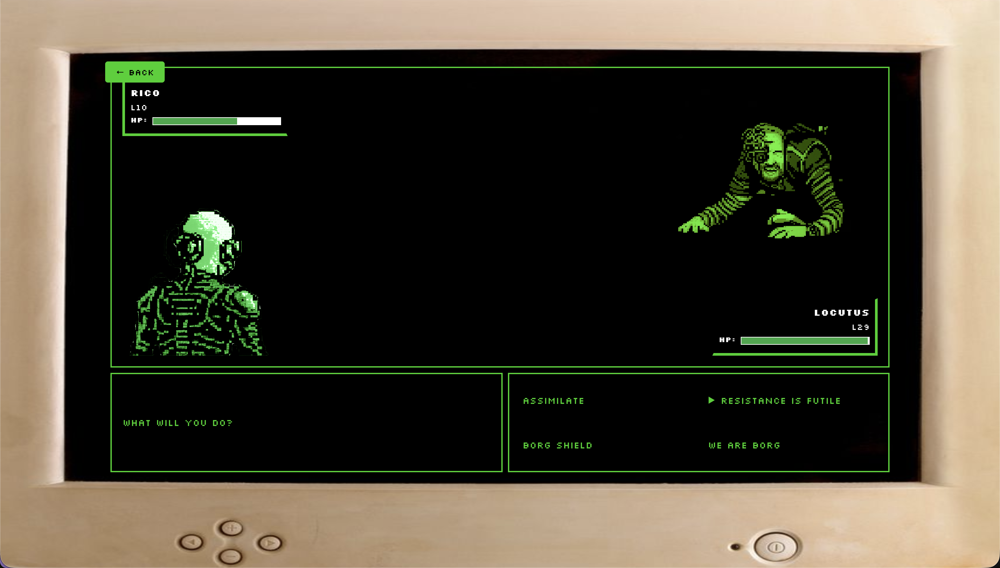

# Ashleigh's Portfolio Website

A creative showcase of what a backend developer can achieve when they decide to have a bit of fun with frontend development. This portfolio website is an interactive experience that pays homage to the films, games, and TV shows from the 80s and 90s that influenced me into becoming a software engineer.

From playing Gizmos & Gadgets on Windows 95 at 6 years old, to building robots inspired by Robot Wars, to being fascinated by the programming concepts in Jurassic Park—this site brings together all those nostalgic influences into one interactive portfolio.

## What's Inside

- **Interactive Terminal**: A Rick and Morty themed terminal experience where you can help save Rick from a security process
- **Pokemon Battle Game**: A turn-based battle game featuring characters from my favorite media
- **Time Machine**: A scrollable journey through my work experience
- **Achievement System**: Hidden achievements scattered throughout the site for curious explorers
- **Quiz**: Test how well you've been paying attention
- **Space Invaders**: A retro-style game featuring my technical skills
- **And more**: Explore to discover all the hidden gems!

This isn't just a portfolio—it's a love letter to the media that shaped my career in tech.

## Installation & Setup

2. Install dependencies:
   ```bash
   yarn install
   ```

3. Start the development server:
   ```bash
   yarn start
   ```

4. Open your browser and visit `http://localhost:8080`

That's it! The site should now be running locally. Explore, interact, and see if you can find all the achievements.

---

<a href="https://ashleighsimonelli.co.uk" target="_blank">Visit the live site</a>
